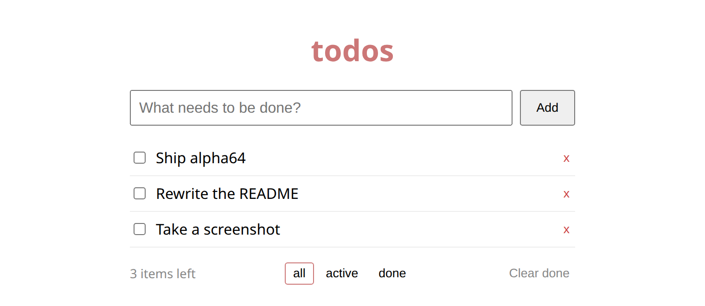

<p align="center">
  
</p>

<p align="center">
  <b>Write the state. Get the app.</b><br>
  One <code>cell</code> is your server state, your database, your sync, and your UI —
  building to browser, desktop and Android from the same two files.
</p>

<p align="center">
  <code>v1.0.0-alpha65</code> · <a href="LICENSE">MIT</a> ·
  <a href="docs/content.md">Docs</a> ·
  <a href="docs/basics/quickstart.md">Quickstart</a> ·
  <a href="CHANGELOG.md">Changelog</a>
</p>

---

## Start

```sh
curl -fsSL https://raw.githubusercontent.com/riagentic/aio/main/install.sh | sh
am create my-app && cd my-app && deno task dev
```

That is a running app: persisted, synced, testable, and one flag away from a
desktop window (`deno task dev --client=electron`) or an Android APK
(`deno task build --targets=android`). Windows: `irm …/install.ps1 | iex`.

## The idea

State lives in a `cell`. You never write a store, an endpoint, a query, a
migration, or a fetch — the cell **is** all of them.

```ts
// counter.ts
import { cell } from "aio";

export const counter = cell("counter", {
  state: { count: 0 },
  methods: {
    increment(s, by = 1) {
      s.count += by;
    },
  },
});
```

```tsx
// App.tsx — reads are reactive, calls dispatch. No hooks, no wiring.
import { counter } from "./counter.ts";

export default function App() {
  return (
    <button type="button" onClick={() => counter.increment()}>
      {counter.count}
    </button>
  );
}
```

Two files. `count` is persisted to SQLite, broadcast to every connected client
as a delta, restored on restart, and drivable from a test — because it is state,
and aio's whole job is state.

<p align="center">
  
</p>

<p align="center"><i>
  <a href="examples/todo">examples/todo</a> — 3 files, no build step, no config.
</i></p>

## What you get

Persistence (worker-thread SQLite) · CRDT sync + offline queue · an ~8 KB
signals renderer · async methods with cancellation · scheduling · HTTP routes ·
full auth with 2FA and OIDC · time-travel · `testCell`/`testUI` · single-binary
builds for browser, Electron, Android, CLI and service — and `am`, a CLI that
inspects and drives any running app.

And one line runs _any_ aio app straight from its repo — installing whatever is
missing, building, and starting it:

```sh
curl -fsSL https://raw.githubusercontent.com/riagentic/aio/main/run.sh | sh -s owner/repo
```

**[→ Every doc on one page](docs/content.md)** ·
[Concepts](docs/basics/concepts.md) · [Pitfalls](docs/basics/pitfalls.md) ·
[API](docs/basics/api-reference.md) · [`am`](docs/clients/app-manager.md)

## Honestly

aio is **alpha**: the surface still moves, each release names its breaks, and
every app pins the version it was written against (`am pin`). It is built for
apps where state is the product — dashboards, ops and trading tools, control
panels, internal tools, local-first desktop and mobile. It is one embedded
process by design, so it is **not** for content sites, SEO, or planet-scale
public APIs. [Positioning & non-goals](docs/basics/positioning.md).

## License

[MIT](LICENSE)
