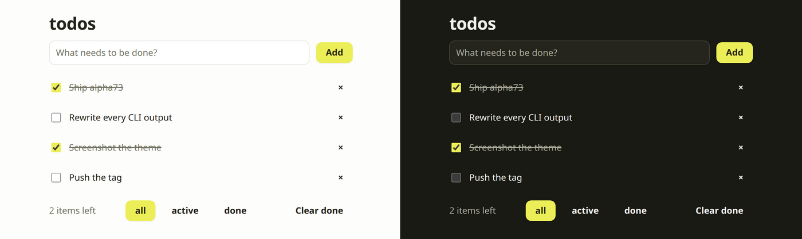

<p align="center">
  
</p>

<p align="center">
  <b>Write the state. Get the app.</b><br>
  One <code>cell</code> is your server state, your database, your sync and your UI —
  building to browser, desktop and Android from the same two files.
</p>

<p align="center">
  <code>v1.0.0-alpha74</code> · <a href="LICENSE">MIT</a> ·
  <a href="docs/content.md">Docs</a> ·
  <a href="docs/basics/quickstart.md">Quickstart</a> ·
  <a href="CHANGELOG.md">Changelog</a>
</p>

---

## ⚡ Start

```sh
curl -fsSL https://raw.githubusercontent.com/riagentic/aio/main/install.sh | sh
am create my-app && cd my-app && deno task dev
```

That is a running app — persisted, synced, testable — and one flag from the
rest:

- 🖥️ **Desktop** — `deno task dev --client=electron`
- 📱 **Android** — `deno task build --targets=android`
- 📦 **One binary** — `deno task compile`
- 🪟 **Windows** — install with `irm …/install.ps1 | iex`

## 🧠 The idea

State lives in a `cell`. You never write a store, an endpoint, a query, a
migration, or a fetch — the cell **is** all of them.

```ts
// counter.ts
import { cell } from "aio";

export const counter = cell("counter", {
  state: { count: 0 },
  methods: {
    increment(s, by = 1) {
      s.count += by;
    },
  },
});
```

```tsx
// App.tsx — reads are reactive, calls dispatch. No hooks, no wiring.
import { counter } from "./counter.ts";

export default function App() {
  return (
    <button type="button" onClick={() => counter.increment()}>
      {counter.count}
    </button>
  );
}
```

Two files. `count` is persisted to SQLite, broadcast to every client as a delta,
restored on restart, and drivable from a test — because it is state, and state
is aio's whole job.

<p align="center">
  
</p>

<p align="center"><i>
  <a href="examples/todo">examples/todo</a> — 3 files, no stylesheet.
  Light and dark come from <a href="docs/ui/theme.md"><code>ui.theme</code></a>,
  whose accent is derived from the app's own name.
</i></p>

## 📦 What you get

|                |                                                                        |
| -------------- | ---------------------------------------------------------------------- |
| 💾 **Data**    | worker-thread SQLite · CRDT sync · offline queue · migrations · backup |
| 🎨 **UI**      | signals renderer · a default theme · routing · forms · SSR + hydrate   |
| 🔐 **Auth**    | sessions · per-user tokens · TOTP · OIDC · PIN pairing                 |
| 🧪 **Testing** | `testCell` / `testUI` — semantic, selector-free · time-travel          |
| 🚚 **Ship**    | browser · Electron · Android · CLI · systemd service · signed updates  |
| 🛠️ **Operate** | `am` — status, health, logs, state, dispatch, pins, installs           |

A whole client — renderer, protocol, offline queue, CRDT merge — is **57 KB
gzipped**, 50 KB brotli. `deno task bench:bundle` prints it, and a gate keeps
this sentence true.

## 🏃 Run any aio app, from its repo

```sh
curl -fsSL https://raw.githubusercontent.com/riagentic/aio/main/run.sh | sh -s owner/repo
```

Installs what is missing, builds, starts it. Nothing to read first.

**[→ Every doc on one page](docs/content.md)** ·
[Concepts](docs/basics/concepts.md) · [Pitfalls](docs/basics/pitfalls.md) ·
[API](docs/basics/api-reference.md) · [`am`](docs/clients/app-manager.md)

## 🎯 Honestly

- 🚧 **Alpha.** The surface still moves. Every release names its breaks, and
  every app pins the version it was written against (`am pin`).
- ✅ **Built for** apps where state is the product — dashboards, ops and trading
  tools, control panels, internal tools, local-first desktop and mobile.
- ❌ **Not for** content sites, SEO, or planet-scale public APIs. It is one
  embedded process, by design.

[Positioning & non-goals](docs/basics/positioning.md)

## License

[MIT](LICENSE)
