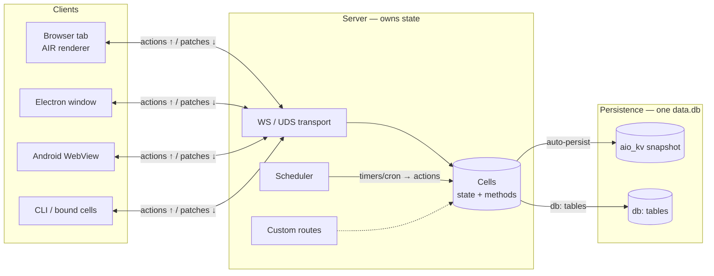
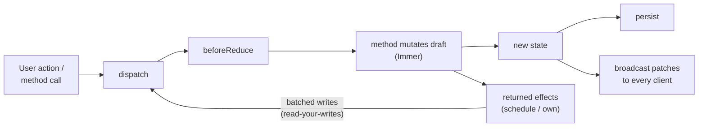
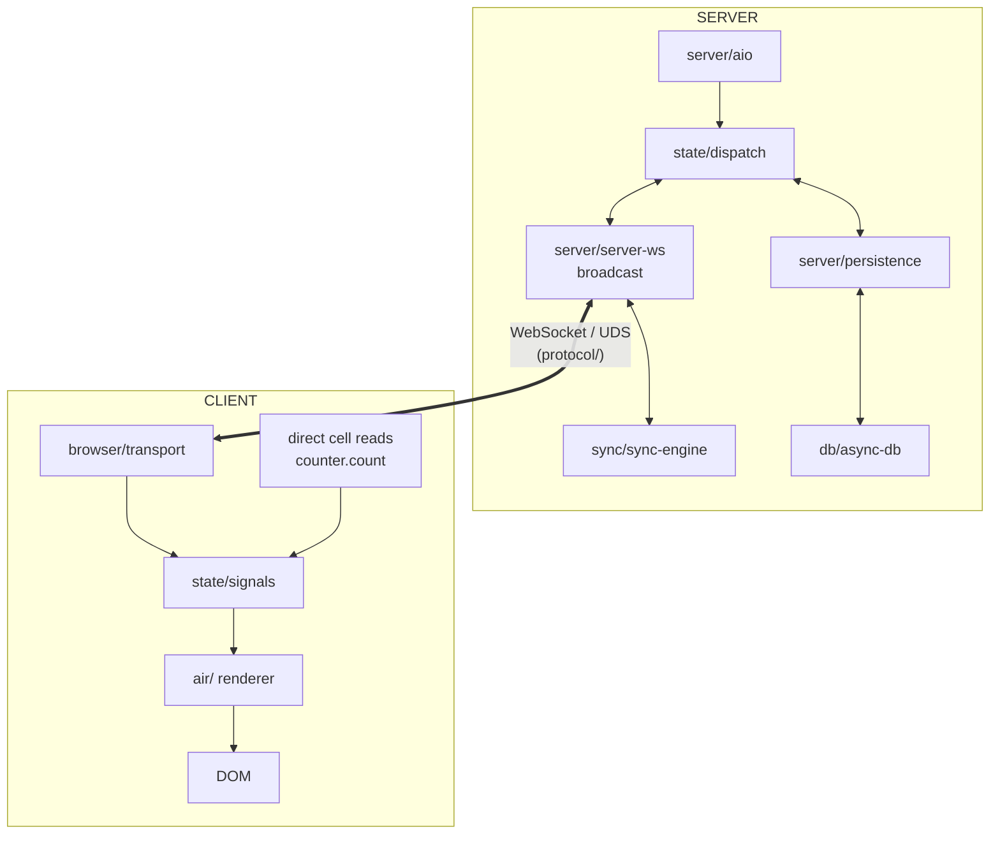

# Architecture

AIO is a full-stack Deno/TypeScript application framework built around **cells**
— self-contained units of state + behavior. Everything flows through cells: UI
reads cells, persistence saves cells, sync replicates cells, testing isolates
cells.

## The Big Picture

One state, propagated everywhere: cells live on the server; every client
receives patches and sends actions over aio's own protocol.

## Core Data Flow

Every state change follows this pipeline. Sync methods are the reducer; async
methods run in the executor and commit batched writes at each `await` boundary.

## Module Map

`src/` root holds only the public entry files (`air.ts`, `browser-air.ts`,
`build.ts`, `am.ts`, `schedule.ts`, …); all implementation lives in domain
folders. The folder dependency matrix is CI-enforced by `deno task boundaries`
(`scripts/check-boundaries.ts`).

| Folder         | Purpose                                                     | Key files                                       |
| -------------- | ----------------------------------------------------------- | ----------------------------------------------- |
| `state/`       | Isomorphic core: cells, signals, dispatch, schedule         | `cell-create.ts`, `signal.ts`, `dispatch.ts`    |
| `protocol/`    | Wire protocol messages + cid/ack + version handshake        | `protocol-types.ts`, `browser-ack.ts`           |
| `air/`         | AIR renderer: vdom, hooks, hydration, SSR, transitions      | `vdom.ts`, `renderer-flush.ts`, `ssr-stream.ts` |
| `browser/`     | Browser client: transport, router, client boot              | `browser-transport.ts`, `browser-air-hooks.ts`  |
| `server/`      | App bootstrap, HTTP/WS/UDS server, persistence, doctor      | `aio.ts`, `server-ws.ts`, `persistence.ts`      |
| `diagnostics/` | Logger, error codes, diagnostic bus, time-travel core       | `error.ts`, `logger.ts`, `diagnostic-bus.ts`    |
| `sync/`        | CRDT sync engine: HLC, merge, rebase, compaction            | `sync-engine.ts`, `merge.ts`, `hlc.ts`          |
| `db/`          | Async SQLite via worker thread                              | `async-db.ts`, `db-worker.ts`                   |
| `vitals/`      | Runtime diagnostics: freeze detection, memory, hints        | `render-meter.ts`, `pressure-monitor.ts`        |
| `build/`       | Build system: bundling, compilation, targets (esbuild here) | `build-bundle.ts`, `build-electron.ts`          |
| `electron/`    | Electron integration: scripts, IPC, spawning                | `electron.ts`, `electron-spawn.ts`              |
| `am/`          | App Manager CLI: inspect, state, process mgmt               | `am-cmd-*.ts`, `am-http.ts`                     |
| `testing/`     | Test harnesses: cell tests, component tests                 | `cell-test.ts`, `test-component.ts`             |
| `adapters/`    | Renderer adapters                                           | `air.ts`                                        |

## Key Boundaries

**Server owns state.** Cells live server-side. The client receives state patches
over WebSocket and renders them. Client actions flow back to the server for
processing.

**Sync is optional.** CRDT sync (`sync/`) runs alongside persistence when
`sync: true` on a cell. It handles HLC timestamps, op-log, merge strategies, and
conflict resolution.

**AIR is the renderer.** AIR (`browser-air.ts` entry, `air/`) uses the state
subscription API. Custom adapters can be built on `state-core.ts`.

## Module Boundaries (CI-enforced)

Folders may only import what the dependency matrix in
`scripts/check-boundaries.ts` allows (`deno task boundaries`, runs in CI):

- `state/`, `protocol/`, `diagnostics/` — isomorphic core, dependency-light
- `browser/` and `air/` — may never import `server/` (a browser-loaded module
  pulling a Deno API would crash the whole client graph)
- `build/`, `am/`, `electron/` — tooling; may use `server/`, never the reverse
  for browser-facing code
- Root entry files (`src/*.ts`) are the public surface — folders may import them
  (barrels carry load-bearing side effects)

## Extension Points

| Extension           | Mechanism                                              | Docs                                  |
| ------------------- | ------------------------------------------------------ | ------------------------------------- |
| Action interception | `beforeReduce` in aio.run config                       | [lifecycle.md](../state/lifecycle.md) |
| Lifecycle hooks     | `onInit`, `onDestroy` per cell                         | [lifecycle.md](../state/lifecycle.md) |
| Sync strategies     | `merge` config per field (lww, counter, set-add, etc.) | [crdt.md](../persistence/crdt.md)     |
| Custom SQL schema   | `table()` definitions in cell config                   | [sqlite.md](../persistence/sqlite.md) |
| Client transport    | WebSocket (default) or UDS (Unix Domain Socket)        | [browser.md](../clients/browser.md)   |

## Programming Model

One style — methods (v2; see [restructure.md](../upgrade/restructure.md)):

| Need              | Style                                              |
| ----------------- | -------------------------------------------------- |
| State changes     | `methods: { add(s, item) { s.items.push(item) } }` |
| Async / workflows | `async` methods + `until`/`race`/`sleep`           |
| Guards            | `if (s.status !== 'idle') return` — a guard line   |
| Cancellation      | `cancelOn` + `s.$signal`                           |

See [State Management](../state/README.md) for the full guide.
